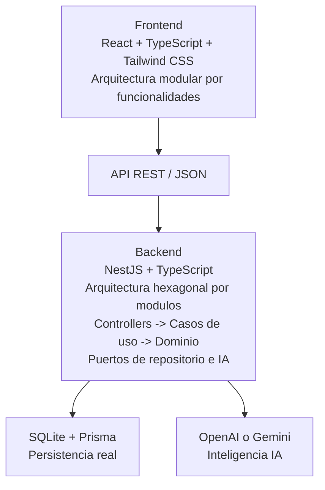

# Arquitectura oficial FixGo IA

FixGo IA se desarrollara como un monolito modular, de acuerdo con lo solicitado por el profesor y con el flujo visual inspirado en Wolly.

## Decisiones principales

- Frontend modular por funcionalidades y componentes.
- Backend con arquitectura hexagonal organizada por modulos.
- API REST para comunicar frontend y backend.
- SQLite con Prisma para persistencia real.
- Inteligencia artificial integrada mediante puertos y adaptadores.

Esta arquitectura permite cumplir los requisitos academicos sin complicar innecesariamente el proyecto con microservicios.

## Diagrama general



## Regla de organizacion

El proyecto se mantiene como un solo sistema, pero separado internamente por responsabilidades:

- `frontend/`: experiencia de usuario, pantallas, componentes y consumo de API.
- `backend/`: reglas de aplicacion, dominio, puertos, adaptadores y API REST.
- `backend/database/`: SQLite, SQL base, seed y migraciones.
- `backend/prisma/`: modelo Prisma conectado a SQLite.

## Backend

Cada modulo funcional del backend debe tender a esta estructura:

```text
module/
  domain/
    *.entity.ts
    *.repository.ts
  application/
    *.service.ts
    *.command.ts
  infrastructure/
    prisma/
      prisma-*.repository.ts
    ai/
      *.adapter.ts
  presentation/
    dto/
      *.dto.ts
    http/
      *.controller.ts
  *.module.ts
```

### Flujo backend

```text
Controller HTTP
  -> Caso de uso / Application Service
    -> Dominio
      -> Puerto de repositorio o IA
        -> Adaptador Prisma / Adaptador IA
```

## Frontend

El frontend debe organizarse por funcionalidades:

```text
src/
  app/
    router/
    providers/
    layouts/
  modules/
    auth/
    service-request/
    budgets/
    professionals/
    home/
  shared/
    components/
    hooks/
    types/
    utils/
    styles/
  main.tsx
```

Cada modulo frontend puede dividirse asi cuando tenga suficiente logica:

```text
module/
  domain/
  application/
  infrastructure/
  presentation/
```

## Persistencia

- La base oficial es SQLite.
- Prisma es el acceso del backend a la base.
- React nunca se conecta directamente a SQLite.
- Toda lectura y escritura pasa por la API REST del backend.

## Inteligencia artificial

La IA no debe vivir en React ni en controladores.

La integracion debe seguir esta regla:

```text
Application Service
  -> Puerto de IA
    -> Adaptador OpenAI, Gemini u otro proveedor
```

Esto permite cambiar de proveedor sin reescribir el flujo de negocio.

## Estado actual

- Backend ya inicio la migracion a arquitectura hexagonal en `categories`, `professionals` y `service-requests`.
- Frontend existe como aplicacion modular inicial y debe reorganizarse progresivamente hacia la estructura oficial.
- SQLite y Prisma ya estan integrados con la base completa.
